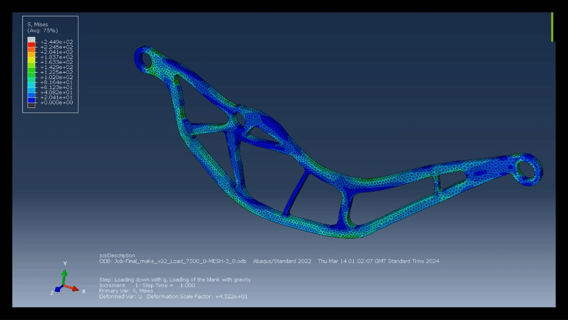
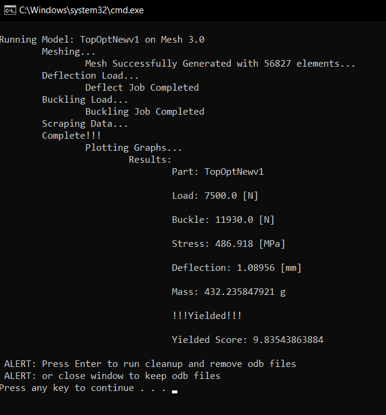
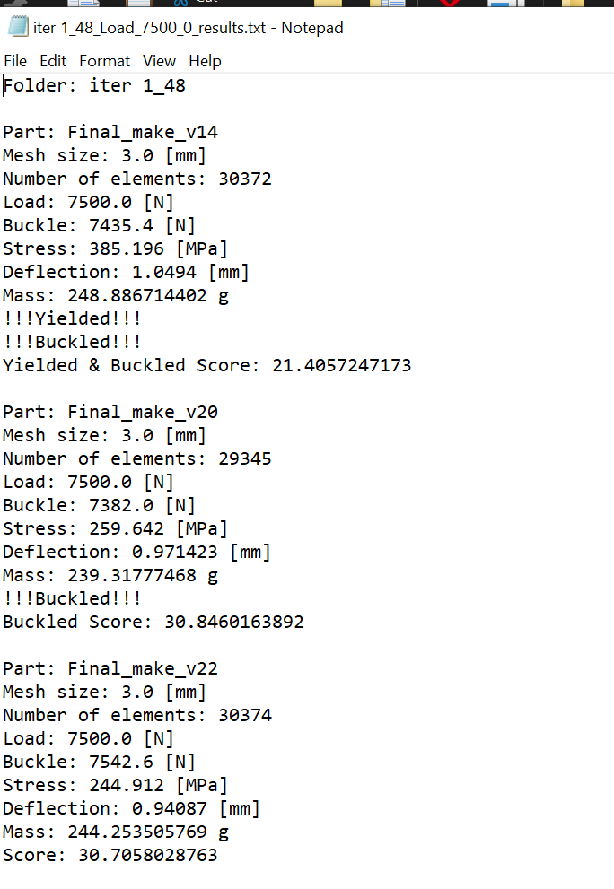
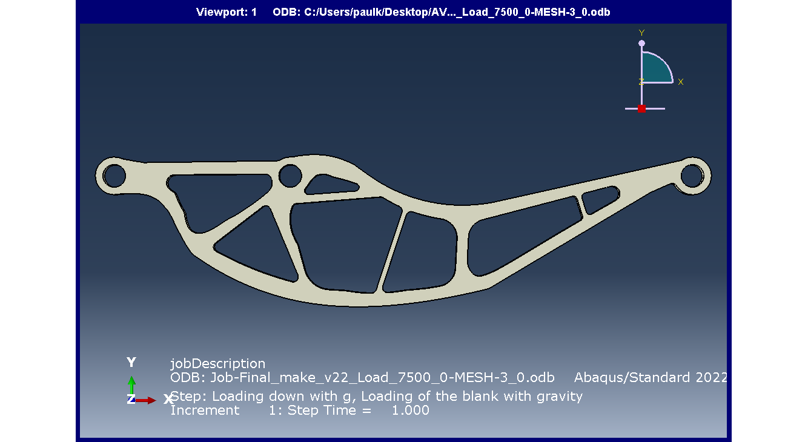
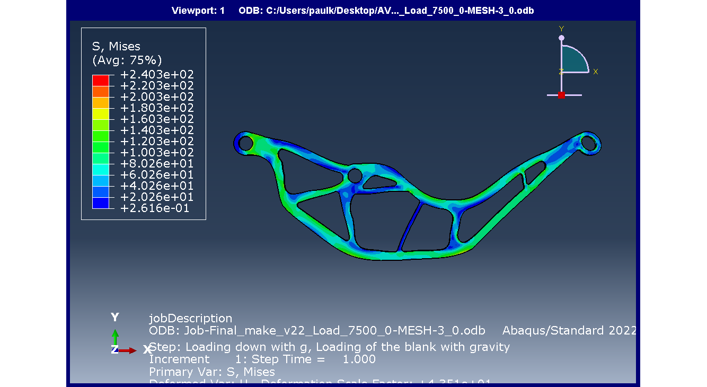
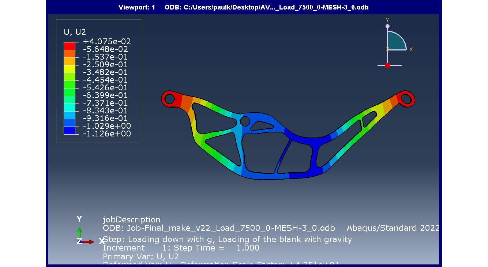
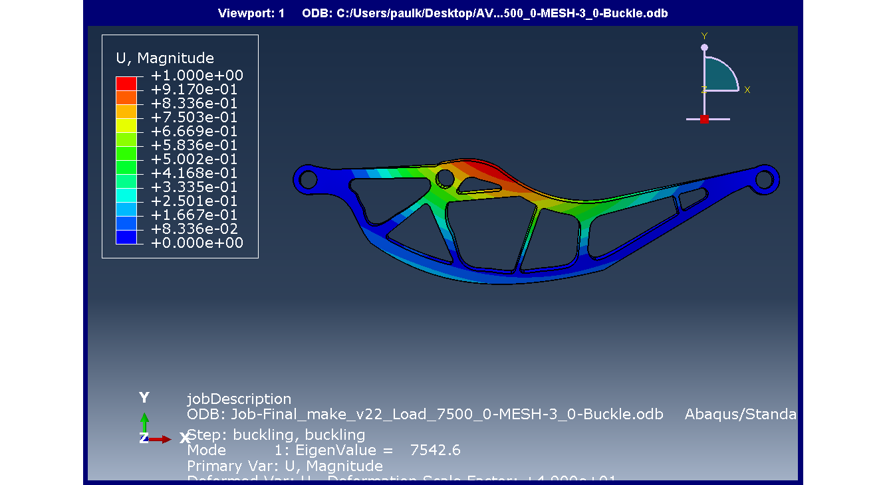

This repository includes the project I and @Gutimoli completed in order to design a detailed component for an aircraft structure.

Given alterations to the main.py file one can choose:

    - Mesh sized for a convergance study
    - Load sizes for a failure study

Furthermore to effecivley use this repo:

    - run "new folder.bat" in order to create a new geometry and iteration folder
    - Create a step file geometry that satisfys the components requirements
    - place step file and any other designs into the Geometry folder of the current iteration number
    - run either "script.bat" or "nogui.bat" for a gui or cmd line interface for the analysis
    - the results will open as a ".txt" file and also be stored

The following are some of the output of the automated script in terminal and txt file:

Simulation with gui:

Terminal:

Text:

Final Iteration:
    
    -Part: Final_make_v22
    -Mesh size: 3.0 [mm]
    -Number of elements: 30374
    -Load: 7500.0 [N]
    -Buckle: 7542.6 [N]
    -Stress: 244.912 [MPa]
    -Deflection: 0.94087 [mm]
    -Mass: 244.253505769 g
    -Score: 30.7058028763

Undeformed:

@ Ultimate Load:  
    -Von Mises Stress

    -Deflection

@ Buckle:
